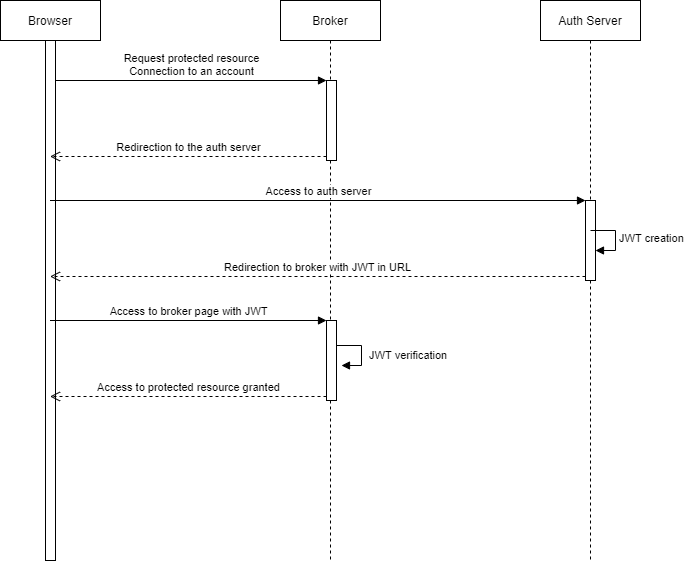

# SSO-auth-server
A PHP-based SSO auth server built using 
- [Spectre.css](https://picturepan2.github.io/spectre/) for design simplification 
- [Route by ThePHPLeague](https://route.thephpleague.com/) for routes and middleware
- [Plates by ThePHPLeague](http://platesphp.com/) for view rendering
- [PHP-JWT by Firebase](https://github.com/firebase/php-jwt) for JWT tokens

# Installation
The easiest way to install this is to clone the repository. (Assuming to be in the root directory in the list under)
1. Run `composer install`
2. Setup the database. As for now, there is only a process described in [create_env.sql](install/create_env.sql) (which can be customised and then run, or even run in CLI, that's your choice)
3. Rename the config file (`mv /includes/config.example.php /includes/config.php`), then customise it. For that, you will need a few info:
    - Database information: system (mysql, psql, etc), hostname, database, table, username and finally password.
    - RSA keypair: You will need to generate a keypair (which can easily be done with openssl, by the way). Default is RSA, feel free to go into the `SSOController` to change algorithm
    - SSO server hostname: Basically, the URL your server will be at (i.e. `accounts.example.com`). Used as a verifier for brokers because it is used as an issuer claim in JWTs

# What is this designed for?
First, you must know what is SSO. In one sentence, SSO stands for Single Sign-On, meaning connecting on this site will grant you access to every broker recognising this SSO authentification server as trusted (meaning they implemented how they recieve the JWT, etc.)
Now, the server itself. It is created and built to be used as a small SSO server to simplify connections inside small structures, or for any other use related to this.

# How is it designed? How does it work?

## What it does not do
This SSO authentication is what I call "desynchronised". By that, it does not implement any update on the user information at each page reload or anything like that. Which means if the user updates his profile, it will only be updated with the next JWT you get. For now, I don't have an easy way to do this.
Also, it does not implement SLO (Single Log-Out) at all (for now at least, I hope to include that later).

## The SSO server 
I will explain that with an UML Sequence:

Basically, the connection to the account is done through the authentication server:
1. The user is redirected to the auth server from the broker (site that wants the user information).
2. The user then connects if needed, and is redirected to the broker with a JWT (JSON Web Token) linked in URL, containing the user information
3. The broker recieves the token and you should be connected.

## On the broker side
Now, comes the main problem: how to implement this SSO server?

The page that will interest you the most is the SSO\_AUTH constant, which is by default `/auth`. This is the path you will want to send your return URL (RETURN\_URL) to.
Your return URL is the URL of the page that will handle the JWT token, i.e. `http://example.com/login`.

You have to send it following the pattern `SSO_AUTH?url=RETURN_URL`, SSO\_AUTH and RETURN\_URL being both as mentioned above.
You will then recieve the token in the `token` parameter in your RETURN\_URL.

You now have to verify the JWT token, to be sure it was not modified during transport. The JWT being signed with a private key, you will need the public key, which you can store in your broker when you setup your config file. If you ever need it again, directly through GET requests, you can find it at SSO\_PUBKEY, which is `/pubkey` by default (it will be returned in body with a Content-Type of `text/plain`, making it easy for you to retrieve it).

# Credits:
- Background image: Image by [Stampf](https://pixabay.com/users/Stampf-1703749/?utm_source=link-attribution&amp;utm_medium=referral&amp;utm_campaign=image&amp;utm_content=3337447) from [Pixabay](https://pixabay.com/?utm_source=link-attribution&amp;utm_medium=referral&amp;utm_campaign=image&amp;utm_content=3337447), modified with PaintDotNet to be darkened and blurred
- Brand logo: profile picture of [Gray Wolf Games](https://twitter.com/graywolfgames) passed through a sepia filter